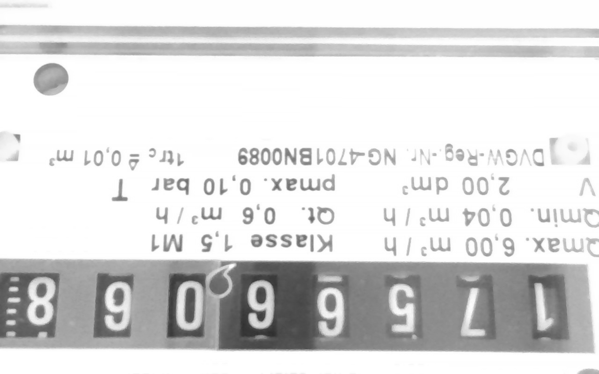
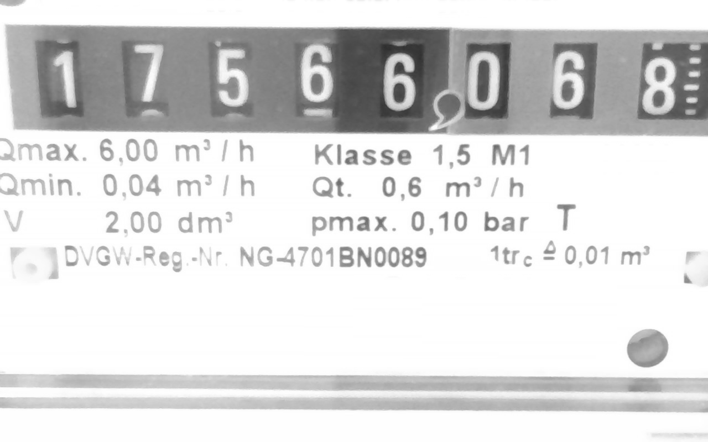
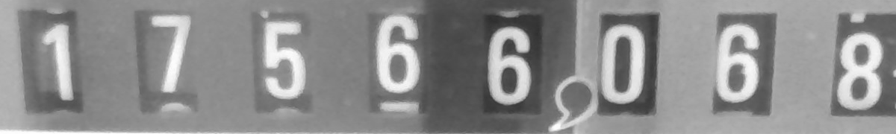
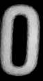
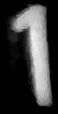
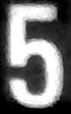
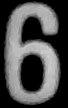
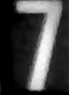
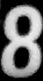
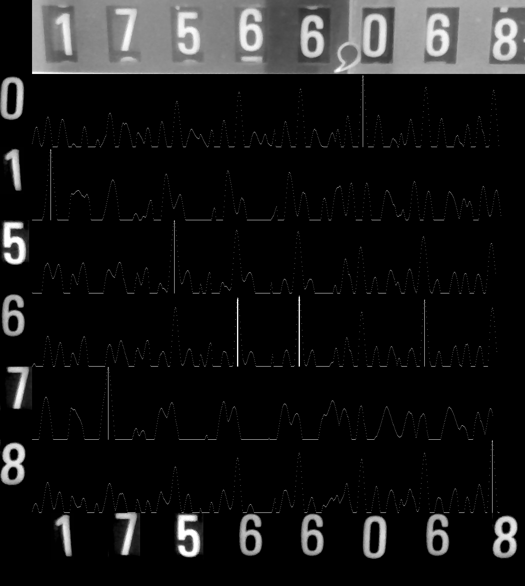

# Read utility meters such as gas, water, or electricity.

Mostly I need that at home to integrate the analog reader output into my
home automation and monitoring.

Rather than doing a generic OCR, this is matching digits using normalized
cross correlation (this requires to extract sample digit images first).

This is meant to read the typical mechanical counters found in utility meters.

## Build

```
cargo build --release
```

There is also `--features=debug_timing` if you want to explore where processing time goes (in particular interesting on slow devices such as a Raspberry Pi)

## Run Synopsis

```
Usage: utility-reader [OPTIONS] [DIGIT_IMAGES]...

Arguments:
  [DIGIT_IMAGES]...  Digit template images to match; the first digit found in the filename is the matched digit. Allows to have multiple templates for the same digit if needed (e.g. d1-0.png, d1-1.png)

Options:
      --webcam                          Capture counter image from webcam
      --filename <png-file>             Read counter image from file
      --op <op>                         Image operation to apply after image is acquired. One of ["rotate90", "rotate180", "flip-x", "flip-y", "crop:<x>:<y>:<w>:<h>"]. Multiple --op are applied in sequence provided on command line
      --sobel                           Process input images through sobel edge-detect. Can improve accuracy with very clean and non-distorted images
      --emit-count <#>                  Number of digits to OCR verify and emit. Good to limit if the last digit is finicky due to roll-over [default: 7]
      --max-plausible-rate <count/sec>  Maximum plausible value change per second to avoid logging bogus values [default: 0.1]
      --repeat-sec <seconds>            Repeat every these number of seconds (useful with --webcam)
      --debug-capture <file-or-dir>     Output the image captured. If existing directory, writes snap-<timestemp>.png images, otherwise intepreted as filename
      --debug-post-ops <file-or-dir>    Output the image after the process ops have been applied. If existing directory, writes processed-<timestemp>.png images, otherwise intepreted as filename
      --failed-capture <file-or-dir>    Output image that could not detect all digits. If existing directory, writes fail-<timestemp>.png images, otherwise intepreted as filename
      --debug-scoring         Generate a debug image that illustrates the detection details
  -h, --help                            Print help
  -V, --version                         Print version
```

## Setup

### Prepare image capture
Note, if you run this on a Raspberry Pi, the Raspberry Pi cameras won't work as they don't show up as Video4Linux devices, so just use a cheap USB web-cam (they are typically < $10, so even cheaper than pi cameras).

First, we have to prepare what is captured. Set up the camera and snap the first picture. We use the `--debug-capture` flag to
emit the image. To make things a bit more complicated, let's assume the only way you could use the camera was upside down:

```
utility-reader --webcam --debug-capture=/tmp/initial.png
```
Don't worry about the error output about not detecting any digits, we're not there yet.

Then check out the image (e.g. `timg` `/tmp/initial.png`)

Original webcam               | --op rotate180                 | --op crop
------------------------------|--------------------------------|--------
  |  | 


It is upside down and contains a lot of stuff that we don't need for digit recongition. Let's first put this image upside down. For that, we can use the `--op` image processing options and emit the resulting picture to `--debug-post-ops`

```
utility-reader --webcam --op rotate180 --debug-post-ops=/tmp/processed.pn
```

Nice, now we only need to crop out the area we are actually interested in. The `--op` flags are processed in sequence, so we now can add a crop operation on top

```
utility-reader --webcam --op rotate180 --op crop:40:60:1200:180 --debug-post-ops=/tmp/processed.png
```

We now have an image that only contains the area we're interested in.

### Set up digits to recognize

The text detection of the `utility-reader` does not use a generic OCR, but matches the images of digits, so we have to prepare these.

Take an image editor and crop out the digits, and write as separate files, with the filename containing the ascii character for
the digit, e.g.

digit-0.png          | digit-1.png          | digit-5.png | digit-6.png          | digit-7.png          | digit-8.png
---------------------|----------------------|-------------|----------------------|----------------------|--------------
 |  |  |  |  | 

Note, depending on your current counter staate, you might need to do this
multiple times until you have all digits collected.

The first digit that is found in the filename is considered the digit it
represents, so it is important to have it in the filename.
You can actually have multiple templates for the same digit in case a single template
is not enough; below in the debugging section you see examples
with multiple templates (in particular the `1` matched two different shapes,
but is interpreted as the same digit).

To test, we can run the program with `--filename` on the image and the `--debug-scoring` flag to check out the score

```
utility-reader --filename img/example-cropped.png --debug-scoring=/tmp/score.png --emit-count=8 img/digit-*
img/digit-1.png    45 0.969
img/digit-7.png   185 0.994
img/digit-5.png   346 0.998
img/digit-6.png   500 0.939
img/digit-6.png   650 0.968
img/digit-0.png   805 0.981
img/digit-6.png   955 0.915
img/digit-8.png  1120 0.993
1768122840 17566068
```

We see the digits that matched and their score (this is emitted by the debug-scoring flag);
this flag also outputs a neat image with sparklines for the match score of each digit

```
timg /tmp/score.png
```


If there is a plausibility check failing (uneven physical distance of digits
or not exepected number of digits), then there is an error message on stderr and
exit code is non-zero (while stdout still outputs whatever digits it could
read). Number of digits that is to be checked and emitted can be controlled with
the `--emit-count`.

### Ready to operate

Now we have the needed image processing prepared, all the digits to be detecgted so now
we can run the program. The `--repeat-sec` option will keep the program running and re-capturing new
images, and output the results to a log, ready to be post-processed.

```
utility-reader --webcam --op rotate180 --op crop:40:60:1200:180 digits/digit*.png >> out.log 2>> error.log &
```

## Debugging

There are a few debugging options which help while setting up the reader the
first time

   * `--debug-capture` option allows to output the captured image to a file,
   * `--debug-post-ops` emits the image _after_ the image process operations.
   * `--debug-scoring` emits an image with detailed detection information (see below)
   * `--failed-capture-dir` collects all images that could not be properly OCR'ed.

### Debug Scoring

With the `--debug-scoring` option, an image file is generated to illustrate how
well each digit scores on each column of the meter image.
It shows the original image, a spark-line of 'matching score' for each digit and
as final row the assembled images of the matching digits.


It also outputs a list (to stderr) with one line per matching digit.
The columns contain the digit, their positions on the x-axis and a score as
well as the digit filename that matched.

Note that in this example, we have multiple templates that represent the same digit. This
is possible and sometimes even needed if different on different wheels are distorted
or have other challenges. In this case name the digits the similar way as before, with the
first digit showing up in the filename being the digit it represents; in the example here
there are for instance two templates for the digit `1` in filenames
`digits/d1-0.png` and `digits/d1-1.png`.

```
digits/d1-1.png    69 0.960
digits/d7-2.png   230 0.975
digits/d5-1.png   385 0.941
digits/d7-2.png   536 0.944
digits/d3-0.png   688 0.975
digits/d2-0.png   838 0.970
digits/d1-0.png  1003 0.978
digits/d3-0.png  1164 0.877
```

## Postprocessing

When running with `--repeat-sec`, the energy reader will regularly read the
values from the counter and write to stdout; timestamp and value.

You can use the awk-script [`plot.awk`](./plot.awk) to postprocess that data
to adapt the decimal point and calculate some derivation to calculate the
currently used Kilowatt, and then use the gnuplot
script [`plot.gp`](./plot.gp) to generate a graph.

```
./plot.awk < reader.log > /tmp/data.log
./plot.gp
```

The gnuplot script will directly draw the graph on the terminal (should be
sufficiently modern terminal, such as `konsole`, but most can do graphics these
days); alternatively you can modify the script to output to a PNG.

The following example also shows that it is good to have some light-source for
the camera to see at night :)


[timg]: https://timg.sh
