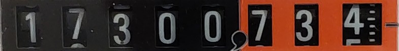
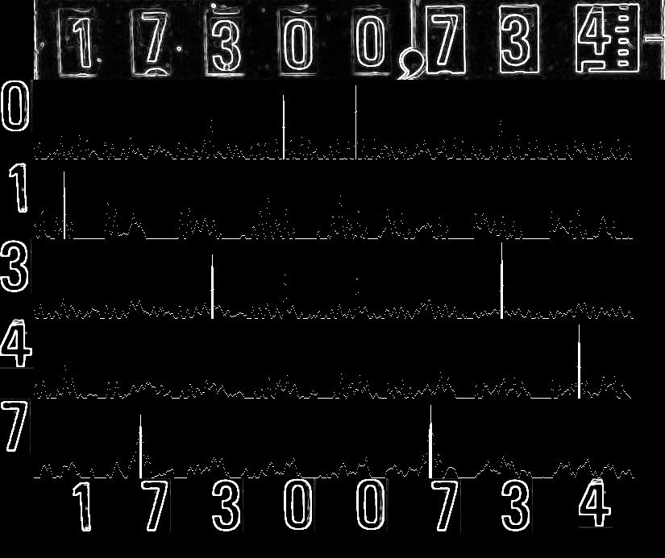
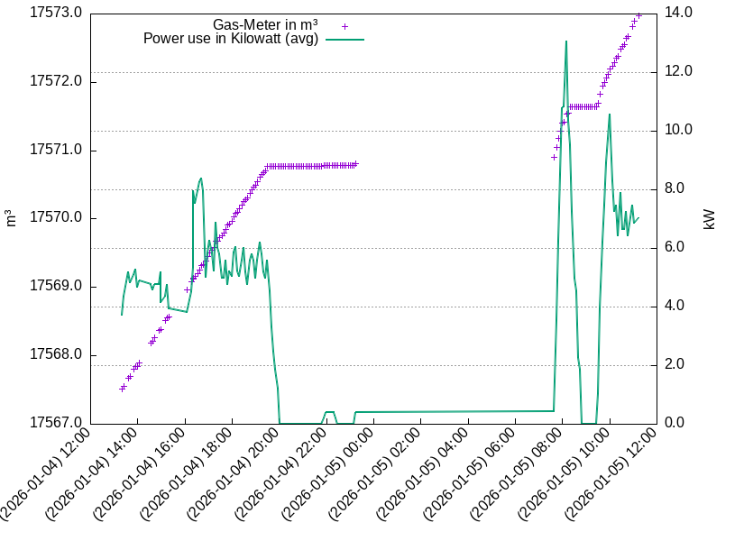

# Read energy counter such as gas or electricity.

Mostly I need that at home to integrate the analog reader output into my
home automation and monitoring.

Rather than doing a generic OCR, this is just matching digits using normalized
cross correlation.

## Build

```
cargo build --release
```

## Run

```
Usage: energy-reader [OPTIONS] [DIGIT_IMAGES]...

Arguments:
  [DIGIT_IMAGES]...  Digit template images to match; the first digit found in the filename is the matched digit. Allows to have multiple templates for the same digit if needed (e.g. d1-0.png, d1-1.png)

Options:
      --webcam                     Capture counter image from webcam
      --filename <png-file>        Read counter image from file
      --op <op>                    Image operations to apply (in that sequence) after image is acquired. One of ["rotate90", "rotate180", "crop:<x>:<y>:<w>:<h>"]
      --sobel                      Process input images through sobel edge-detect. Can improve accuracy with very clean and non-distorted images
      --emit-count <#>             Number of digits to OCR verify and emit. Good to limit if the last digit is finicky due to roll-over [default: 7]
      --repeat-sec <seconds>       Repeat every these number of seconds (useful with --webcam)
      --debug-capture    Output the image captured
      --debug-post-ops   Output the image after the process ops have been applied
      --debug-scoring    Generate a debug image that illustrates the detection details
      --failed-capture-dir <dir>   Directory to store images that could not detect all digits
  -h, --help                       Print help
  -V, --version                    Print version
```

The digit-images need to be extracted from images of counters before, i.e. single digits the same size as they appear in the counter, e.g. looking like:


Then running the program with `--filename` on the image:



will output the sequence of digits observed including timestamp here `17300734`, so it can be used directly in scripts for further processing.

If there is a plausibility check failing (uneven physical distance of digits
or not exepected number of digits), then there is an error message on stderr and
exit code is non-zero (while stdout still outputs whatever digits it could
read). Number of digits is provided with `--expect-count`.

If instead of `--filename`, the `--webcam` option is used, the image is fetched
from the webcam. The `--repeat-sec` option will keep the program running and
re-capturing new images.

Since the image from the webcam probably needs some massaging, there are
operations that can be applied in sequence before sent to the digit detection.
`--op rotate180 --op crop:10:30:1280:200`
Use `--debug-post-ops` to determine if the resulting image is as expected
(Since you're on a shell, you probaly want to use [timg](https://timg.sh) as
image viewer).

## Debugging
The `--debug-capture` option allows to output the captured image to a file,
which can be useful to check alignment and the initial init of match digits.

With the `--debug-scoring` option, an image file is generated to illustrate how
well each digit scores on each column of the meter image.
It shows the edge-preprocessed original image, a spark-line of 'matching score'
for each digit and as final row with the assembled images of the match digits.



It also outputs a list (to stderr) with one line per matching digit.
The columns contain the digit, their positions on the x-axis and a score as
well as the digit filename that matched.

```
1   37 0.839 digits/d1-0.png
7  132 0.791 digits/d7-0.png
3  221 0.802 digits/d3-1.png
0  309 0.797 digits/d0-0.png
0  399 0.927 digits/d0-0.png
7  492 0.909 digits/d7-0.png
3  580 0.957 digits/d3-0.png
4  676 0.921 digits/d4-0.png
```

## Postprocessing

When running with `--repeat-sec`, the energy reader will regularly read the
values from the counter and write to stdout; timestamp and value.

You can use the awk-script [`plot.awk`](./plot.awk) to postprocess that data
to adapt the decimal point and calculate some derivation to calculate the
currently used Kilowatt, and then use the gnuplot
script [`plot.gp`](./plot.gp) to generate a graph.

```
./plot.awk < reader.log > /tmp/data.log
./plot.gp
```

The gnuplot script will directly draw the graph on the terminal (should be
sufficiently modern terminal, such as `konsole`, but most can do graphics these
days); alternatively you can modify the script to output to a PNG.

The following example also shows that it is good to have some light-source for
the camera to see at night :)


